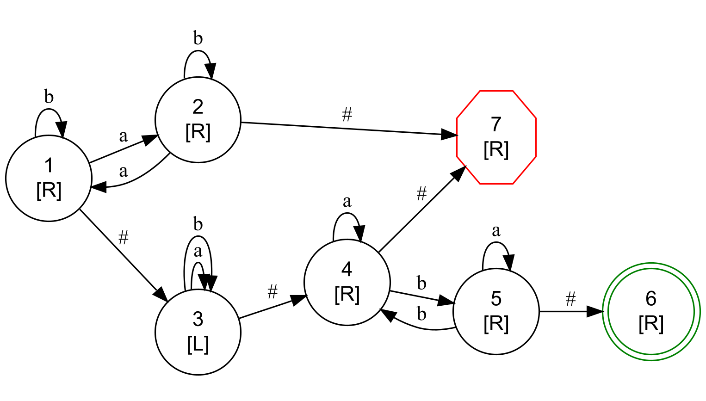

# Two-Way Acceptor (2DFA) in Go

A minimal two-way finite-state acceptor in Go.  
It reads a tape over `{a,b}` with endmarkers `#`, moves the head `LEFT/RIGHT`, and decides `ACCEPT/REJECT` using only:
- the current state pointer (a node in a linked graph), and
- the head index on the tape.

Given `rules.txt` (the automaton) and a tape like `"#ababb#"`, the program:
- parses rules into a node-linked graph (each state has its own L/R direction and edges for `#`, `a`, `b`);
- prints a text graph dump;
- exports a Graphviz DOT file (`fsm.dot`);
- runs a step-by-step trace and prints the final decision.

---

### Quick Start

```bash
   go run main.go rules.txt "#ababb#"
```

Notes:

- The second argument can be #...# or just ... (only a/b allowed).

- Output includes: text dump, fsm.dot, execution trace, and final decision.

- Build a binary:
```bash
- go build -o tw2dfa main.go  ./tw2dfa rules.txt "#ababb#"
```


# Data Structures (2DFA)

## Move
```go
    const (
        L Move = -1
        R Move = +1
    )
````
- Direction of the head: L = left, R = right.

- Values are -1/+1 so you can do i += int(dir).

### State (runtime node)


```go
    type State struct {
        id     int
        dir    Move   // this state's direction (L/R)
        onHash *State // when reading '#'
        onA    *State // when reading 'a'
        onB    *State // when reading 'b'
        accept bool
        reject bool
    }
```

- One node per state.

- On each step: read symbol → follow on* → move by current state's dir.

- If accept or reject is true, the machine halts.

### rawLine (parsed rule line)

```go
    type rawLine struct {
        id    int
        dir   Move
        pairs [][2]string // e.g., {"a","2"}, {"#","3"}
        acc   bool
        rej   bool
    }
```

- Direct result of parsing one line in rules.txt.

- dir applies to all (sym,to) pairs on that line.

- Later converted into linked State nodes (strings → pointers).

### Visualize the graph:
```bash
  dot -Tpng fsm.dot -o fsm.png
```


### Rules Format (`rules.txt`)

Each line defines one **state node**.  
The line begins with `N]`, followed by the state's **movement direction** (`left` or `right`),  
then one or more transitions `(symbol,nextState)`.  
You may also mark terminal states with `accept` or `reject`.

---
### Grammar
```text
<state] <dir> (<sym>,<to>) (<sym>,<to>) ...
<state] accept
<state] reject
```


Where:

- `state`: positive integer (start state is 1)
- `dir`: left or right (no stay)
- `sym`: a | b | # (# is read when the head is outside the tape bounds)

The direction on the line applies to all (sym,to) pairs on that line

Blank lines are ignored; lines starting with // or # are treated as comments


### Example rules.txt

Accepts strings with an even number of a and an odd number of b:

```text
    1] right (a,2) (b,1) (#,3)
    2] right (a,1) (b,2) (#,7)
    3] left  (a,3) (b,3) (#,4)
    4] right (a,4) (b,5) (#,7)
    5] right (b,4) (a,5) (#,6)
    6] accept
    7] reject
```
### What You Will See

#### Text graph dump
```text
    === FSM (node graph) ===
    1] dir=R  (a->2) (b->1) (#->3)
    2] dir=R  (a->1) (b->2) (#->7)
    3] dir=L  (a->3) (b->3) (#->4)
    4] dir=R  (a->4) (b->5) (#->7)
    5] dir=R  (a->5) (b->4) (#->6)
    6] [ACCEPT]
    7] [REJECT]
```


### DOT export fsm.dot

Open with Graphviz:
```bash
  dot -Tpng fsm.dot -o fsm.png
```


- Accepting states: doublecircle (green)

- Rejecting states: octagon (red)

- Node label shows stateId and [L] or [R]

### Execution trace (excerpt)
```text 

    == TRACE START ==
    Tape : #ababb#
    ^
    step  state(dir)  read  next  move  head
    0     1(R)        a     2     R     0->1
    1     2(R)        b     2     R     1->2
    ...
    == ACCEPT ==
    Final: #ababb#  =>  ACCEPT
```

### Design minds

- Linked-node FSM: each State stores dir (L/R) and edges onA, onB, onHash (pointers).

- Two-way behavior: read symbol (a/b or #), follow the corresponding edge, move by the current state’s direction (L/R).

- No working memory: no counters, no tape writes, no tables at run time—only the state pointer and head index.

- Safety: a large step cap prevents non-halting runs if rules are ill-formed.